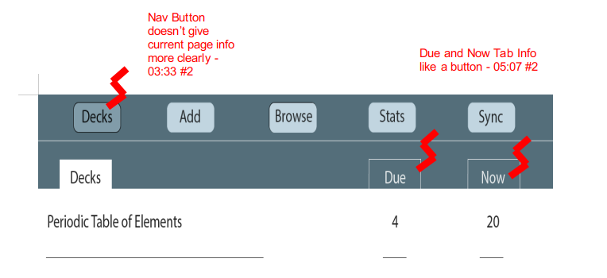
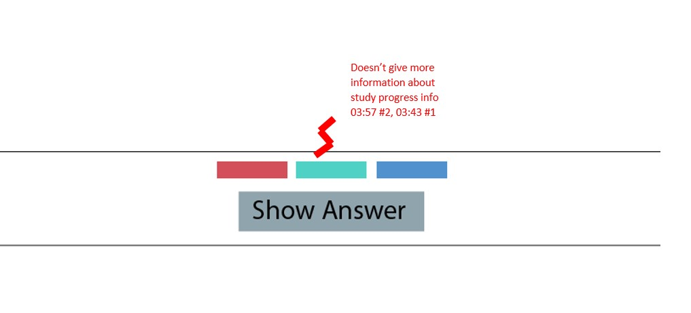
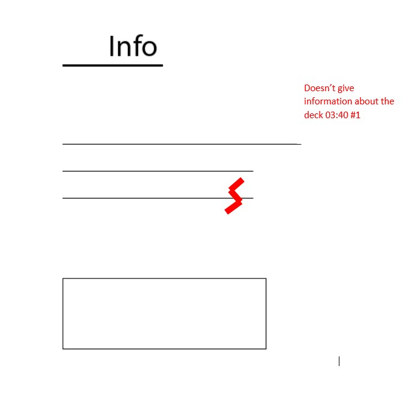
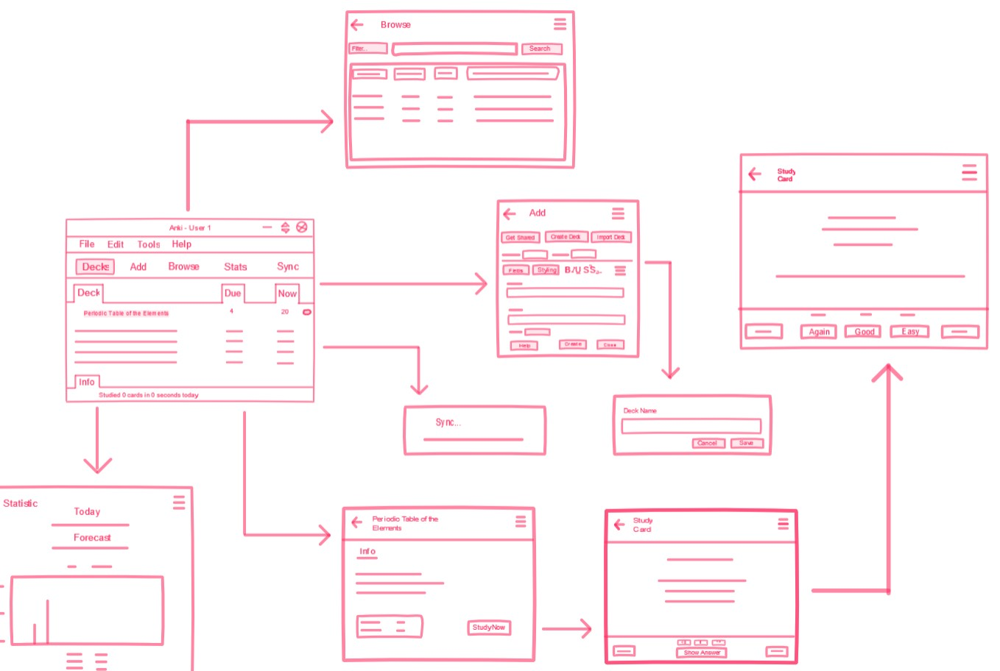
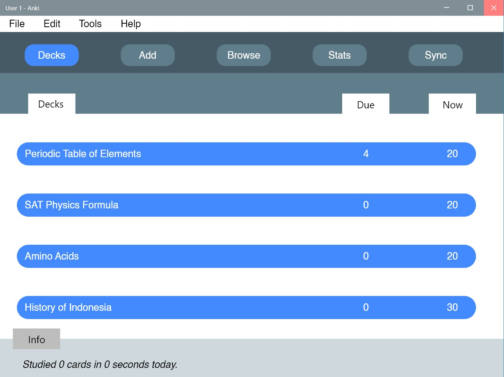

# Usability Evaluation and Prototyping (again)

> Usability Evaluation in this assignment is to evaluate your high-fidelity interactive-prototype with two participants:
> the participant from the previous Contextual Inquiry (CI)
> and an additional novice-participant with different demographics if possible.
> Respectively, revise your prototype as an attempt to fix any problems found in this Usability Evaluation.

## Content

* [Operating the Prototype](#Operating-the-Prototype)
* [Part A: Usability Evaluation](#Part-A:-Usability-Evaluation)
  * [1. Brief Description of Participants](#1-Brief-Description-of-Participants)
    * [2. Evaluation Script](#2-Evaluation-Script)
    * [3. Transcript](#3-Transcript)
      * [a. Transcript with Participant 1](#a-Transcript-with-Participant-1)
      * [b. Transcript with Participant 2](#b-Transcript-with-Participant-2)
    * [4. Feedback and Incidence Analysis](#4-Feedback-and-Incidence-Analysis)
* [Part B: Prototyping (again)](#Part-B:-Prototyping-(again))
  * [Sketch](#Sketch)
  * [Design Rationale](#Design-Rationale)
  * [High-Fidelity Interactive-Prototype](#High-Fidelity-Interactive-Prototype)

## Operating the Prototype

> Record a video (screen-recording is preferred) while you operating your prototype.
> Present the ideal case on how to interact with the prototype from the beginning to the end.
> Upload the video on any video-sharing website (e.g., YouTube), then attach the video link on this report.

---

## Part A: Usability Evaluation

> In this part, you should prepare your high-fidelity interactive-prototype from the assignment 2.
> Invite the participant from your previous CI to test the prototype.
> You also need to invite one more novice participant.
> As with the CI, you might need to videotape your sessions.
> You can benefit from the videotape while writing your `Recording Transcript` later.

### 1. Brief Description of Participants

#### a. Description of Participant 1

* The User is male, 20 years old, from Informatics ITS 2017
* He has experiences using computer and always work with it
* Know what flashcard is
* But he doesn't familiar with flashcard application
* He never use flashcard as study method
* Not a person who takes a time to read documentation

#### b. Description of Participant 2

* The User is male, 20 years old
* He doesn't know about flashcard
* Using laptop and phone a lot
* He doesn't follow technology development
* Not a person who enjoy learning by doing (self-taught)

### 2. Evaluation Script

> Write the questions you ask and the instructions you use to direct the participants on what to do.
> If it is the same as previous assignments, please mention this, yet go ahead and INCLUDE it again,
> so we have everything in one place.
> Note that the evaluation script must include exactly what you plan to say to the participants.

#### Instruction

1. Find out what is flashcard and Anki
2. Find out documentation of Anki
3. Open Anki and figure it out
4. Try to explore Anki
5. Try to create deck and card
6. Try to use it
7. Find out what user feel about Anki for using it first time

### 3. Transcript

> Provide a summary of what the participant did and said, and what you did and said.
> If at some points you have to help the participants, because they cannot figure out what to do,
> that scene must be included in the transcript.
> It is not necessary to write down every word the participant said,
> just what is interesting and useful.
> Ensure to write down all the actions on the device, whether correct or wrong.
> Remember to supplement the transcript with time-codes or line-numbers.

#### a. Transcript with Participant 1

* **00:03** 👨‍🔬 Me: Halo sebelumnya terimakasih sudah kembali diwawancarain lagi. Kalo sekarng tuh model yang sudah aku buat prototypenya. Kalo dulu kan aplikasi realnya. Mungkin kamu bisa coba ada yang aneh atau komen aja.
* **00:34** 👨‍💻 Participant: Ok.
(Participant was clicking everywhere to check the feature.)
* **00:40 👨‍💻 Participant: Infonya yang dibawah tidak ada cards dalam beberapa detik dan tidak realtime. Maksud dari ini untuk apa?
* **00:47** 👨‍🔬 Me: Oh itu memang seperti itu karena baru prototype. Tapi info itu gunanya untuk kasi tau udah belajar berapa card selama sekian waktu.
(Participant click Periodic Table Deck.)
(Participant guess the button function.)
(Confuse with minimal information on prototype.)
* **01:00** 👨‍💻 Participant: Mana nih. Udah nih gabisa liatin soal?
* **01:15** 👨‍🔬 Me: Belum karena ini baru gambaran kasarnya lah untuk aplikasi nanti.
* **01:17** 👨‍💻 Participant: Oke oke siap.
(Participant explore the button and click back button.)
* **01:27** 👨‍💻 Participant: Due, Now, 4, 20?
(Confuse with Due and Now nav page.)
(Clicking the Sync button.)
* **01:33** 👨‍💻 Participant: Oh Sync itu...?
* **01:35** 👨‍🔬 Me: Ya gambarannya tuh kalo di Sync akan muncul seperti ini. Pop up. Progress-nya akan seperti ini.
* **01:39** 👨‍💻 Participant: Oh, oke oke. Oke coba buat baru.
(Clicking Add page button.)
* **01:49** 👨‍💻 Participant: Get Shared.
(Clicking Get Shared button.)
(The browser redirect the link to Anki website.)
* **01:51** 👨‍💻 Participant: Oh ini ngambil?
* **01:54** 👨‍🔬 Me: Ya ini dapetin decknya dengan redirect ke website Anki.
(Back to app. Clicking Create Deck button.)
* **01:59** 👨‍💻 Participant: Coba saya buat sendiri.
(Click Create Deck button and typing.)
* **02:00** 👨‍💻 Participant: Oh belum bisa.
(Clicking help button.)
* **02:08** 👨‍💻 Participant: Ok.
* **02:09** 👨‍🔬 Me: Ikuti hotspotnya.
* **02:11** 👨‍💻 Participant: Ngeliatnya darimana? Oh dari situ. Sip. Browse juga.
(Back to Deck Page and click Browse Page button.)
* **02:19** 👨‍🔬 Me: Menurutmu ini untuk apa?
* **02:22** 👨‍💻 Participant: Emm... browse banyaknya, semua deck, buat liatin semua deck. Ok mantap.
(Back to Deck Page and click Stat Page button.)
* **02:54** 👨‍💻 Participant: Kenapa forecast?
* **02:55** 👨‍🔬 Me: Itu untuk memprediksi progress belajarmu gimana.
* **03:03** 👨‍💻 Participant: Siap siap. Udah itu aja ya?
* **03:09** 👨‍🔬 Me: Mungkin ada saran atau apa gitu? Seperti kelebihan atau kekurangan dari aplikasi yang sebelumnya.
* **03:22** 👨‍💻 Participant: Mungkin kolom ini terlalu gede. Sebenarnya gausah gede-gede, kecilin aja.
(Show the nav info layout.)
(Show the Study Card page.)
* **03:40** 👨‍💻 Participant: Ya terus info cardnya belum keliatan jadi gatau mau gimana.
(Show the progress info on study card page.)
* **03:43** 👨‍💻 Participant: Terus ini merah, hijau, birunya belum jelas.
* **03:54** 👨‍🔬 Me: Oh jadi itu fungsinya buat liat sisa kartu yang harus dipelajari ulang atau sudah paham.
* **04:10** 👨‍💻 Participant: Oh ngulang ya kalo gagal?
(Show the Answer page.)
* **04:13** 👨‍🔬 Me: Terus ini buat seberapa paham kamu tentang materinya. Kalo klik ini akan diulang lagi pertanyaannya.
* **04:22** 👨‍💻 Participant: Oh berarti kalo klik easy ga akan keluar lagi seharusnya?
* **05:01** 👨‍🔬 Me: Ok terimakasih ya.

#### b. Transcript with Participant 2

* **00:01** 👨‍🔬 Me: Halo, aku mau nanya nih, sebelumnya kamu tau flashcard itu apa ga?

* **00:08** 👨‍💻 Participant: Enggak.

* **00:09** 👨‍🔬 Me: Oh yaudah jadi flashcard itu kayak metode belajar yang menggunakan kartu yang didepannya itu ada sebuah pertanyaan. Kamu mengingat-ingat jawaban dari pertanyaan itu. Jawabannya ada di belakang kartu itu.

* **00:33** 👨‍🔬 Me : Nah, jadi ini ada aplikasi namanya Anki. Bisa dilihat Anki itu seperti apa. Nah aku membuat ulang Anki itu seperti apa. Anki itu modelnya seperti apa. Mungkin kamu bisa mendemokan fiturnya.

* **01:05** 👨‍💻 Participant: Oh jadi tombol Add ini gunanya untuk apa?

* **01:07** 👨‍🔬 Me : Jadi Add itu kayak membuat kartu, nah bisa dilihat ini ada fitur Get Shared dan lainnya.

(Participant click Get Shared button and the browser redirect the link to The Deck Collection.)

* **01:28** 👨‍🔬 Me : Nah ini nge-direct ke website Anki yang mana ada banyak kategori kartu yang bisa di download. Mungkin kamu bisa download untuk lihat caranya.

* **01:44** 👨‍💻 Participant: Aku coba pilih yang Music. Ini terserah?

* **01:45** 👨‍🔬 Me : Iya terserah.

(Participant click download button.)

* **02:28** 👨‍🔬 Me : Nah ini buat import kartunya yang didapat dari komunitas. Coba kamu explore yang lain.

* **02:40** 👨‍💻 Participant: Ini aku mau coba Browse. Ini buat apa?

* **02:51** 👨‍🔬 Me : Jadi ini buat lihat kartu apa yang sudah tersedia. Nah kalo disini contohnya belum ada kartu karena ini masih gambaran aja.

* **03:02** 👨‍💻 Participant: Trus stats ini untuk?

* **03:07** 👨‍🔬 Me : Menurutmu ini untuk apa?

* **03:08** 👨‍💻 Participant: Emm.. Kalo menurutku ini stats ini ngelihat progress kita selama menggunakan Anki ini sih.

* **03:19** 👨‍🔬 Me : Ya benar jadi ini buat ngelihat seberapa jauh kita dan seberapa sering kita belajar pakai Anki.

* **03:31** 👨‍💻 Participant: Trus yang Sync ini untuk apa?

* **03:33** 👨‍🔬 Me : Itu untuk backup kalau punya akun gitu.

(Participant confuse with Nav Button.)
(Participant click Deck Button many times.)
(Participant click Deck Link.)
(Participant click Study Now button.)

* **03:56** 👨‍💻 Participant: Oh.

* **03:57** 👨‍🔬 Me : Nah jadi kan kamu tadi klik deck.. Periodic Table. Nah di deck ini banyak kartu, bisa dilihat. Jadi ini cuma gambaran kasar umumnya. Disini ada pertanyaan. Dan juga ada Show Answer nya.

( Participant confuse with Progress Study Info.)

* **04:27** 👨‍💻 Participant: Trus ini Again, Good, ini untuk apa?

* **04:33** 👨‍🔬 Me : Bingung ya?

* **04:34** 👨‍💻 Participant: Emm.. iya sih.

* **04:38** 👨‍🔬 Me : Jadi ini kayak seberapa paham kamu materi ini. Jadi kalo kamu klik Again, kartunya bakal di repeat lebih sering.

* **05:05** 👨‍🔬 Me : Gimana pengalamannya?

* **05:07** 👨‍💻 Participant: Emm.. sampai sejauh ini udah paham sih kegunaannya seperti apa. Terus kayak...fiturnya udah jelas sih. Cuma di halaman Deck ini ada Due sama Now. Nah itu buat apa gitu.

* **05:53** 👨‍🔬 Me : Ah terimakasih untuk kesempatan kali ini. Terimakasih.

* **05:55** 👨‍💻 Participant: Ya sama-sama.

### 4. Feedback and Incidence Analysis

> Record your observations per prototype screen followed by reference, feedback, incidence, reason, and resolution.

#### OBSERVATION 1

* **Reference**: Participant 2 : 03:33, 05:07.

* **Feedback**: Due and Now Tab Info doesn't clear its a button or not.

* **Incidence**: Participant 2: Clicking the Due and Now Tab Info. Also he was clicking Decks Button while he was currently on Decks Page.

* **Reason**: Participant 2: User can't differentiate button or nav info.

* **Resolution**: Redesign the UI and color.

#### OBSERVATION 2

* **Reference**: Participant 1: 01:43; Participant 2: 03:57
* **Feedback**: Participant 1: The color doesn't give information about the function of this info progress bar. Must include the number.
* **Incidence**: Participant 1: Clicking the progress info. Participant 2: Clicking and not know that is not a button.
* **Reason**: The information doesn't clear what is the function of progress info without the number or tracking info.
* **Resolution**: Give the number of current progress, not only the color.

#### OBSERVATION 3

* **Reference**: Participant 1: 03:40
* **Feedback**: Participant 1: Info card not available.
* **Incidence**: Can't suggest the function of info card.
* **Reason**: Designer not include the info card on prototype.
* **Resolution**: Redesign and include the essential info.

---

## Part B: Prototyping (again)

> Next, you will need to modify your prototype
> based on the resolutions you have suggested in `Feedback and Incidence Analysis`'s observations.

### Sketch

> Draw a sketch of your prototype that is refined based according to the aforementioned observations on a paper.
> Afterwards, scan the sketch or make the photograph of it and attach it on this report's section.
> Please make sure the any texts on the sketch are readable.

### Design Rationale

> Please write a paragraph expressing what you have learned from the usability evaluation,
> and how it is reflected in your design.

From the Usability Evaluation, I understand more about how good is my prototype based on what I created from sketch. From the opinion about my prototype, I redesign everything from the color and give more valuable information.

### High-Fidelity Interactive-Prototype

> Create a high-fidelity interactive-prototype based on the `Sketch` you have drawn.
> You can use any prototyping tools: InVision, Adobe XD, or even Microsoft PowerPoint.

Link (Adobe XD) :
[High Fidelity Protoyping](https://xd.adobe.com/view/8765375a-ba75-4ee2-495a-f5097cf498fd-f154/?fullscreen)